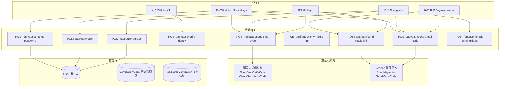
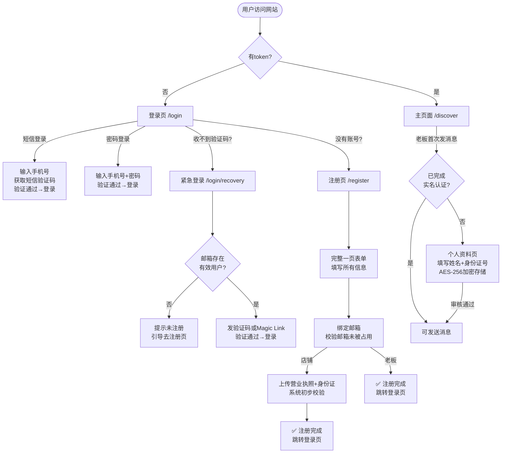

# 搭子星 — 注册/登录认证系统设计总览

## 一、角色定义

| 角色 | 英文 | 说明 |
|------|------|------|
| 店铺 | SHOP | 发布陪玩订单，招募陪玩师。注册时需提交营业执照+身份证图片 |
| 老板 | BOSS | 找陪玩店下单消费。无需营业执照，发消息前需在个人资料页完成实名认证 |

## 二、系统架构图



## 三、完整页面流程



## 四、注册流程详细说明

### 4.1 注册页设计原则
- **一页式表单**：不显示 1-2-3-4 步骤条，所有信息在同一页面完成
- **验证码即填即验**：短信和邮箱验证码收到后立即点击"验证"按钮单独校验，验证通过后该区域锁定（读写禁止），不等到最终提交
- **两段验证锁**：手机和邮箱均验证通过后，"完成注册"按钮才从灰色变为可用状态
- **角色区分**：选择"店铺"时显示营业执照上传区域，选择"老板"时隐藏

### 4.2 老板注册流程
1. 输入手机号 → 获取短信验证码 → 输入验证码 → **点"验证"立即校验** → 手机区域锁定 ✅
2. 选择角色"老板"
3. 填写昵称 + 设置密码（可选）
4. 输入邮箱 → 获取邮箱验证码 → 输入验证码 → **点"验证"立即校验** → 邮箱区域锁定 ✅
5. "完成注册"按钮变为可用 → 点击提交 → 跳转登录页

> **老板无需上传营业执照**，实名认证在个人资料页单独处理。

### 4.3 店铺注册流程
1. 输入手机号 → 获取短信验证码 → **点"验证"立即校验** → 手机区域锁定 ✅
2. 选择角色"店铺" → 营业执照上传区域出现
3. 填写昵称 + 设置密码（可选）
4. 输入邮箱 → 获取邮箱验证码 → **点"验证"立即校验** → 邮箱区域锁定 ✅
5. 上传营业执照 + 负责人身份证正/背面图片
6. "完成注册"按钮变为可用 → 点击提交 → 跳转登录页

### 4.4 验证码时效性保障 ⭐ 重要

**问题**：如果等到最终点"完成注册"才校验验证码，用户在一页式表单中停留超过5分钟（如上传图片、填写资料等），验证码过期会导致提交失败，体验极差。

**解决方案：验证码即填即验（Inline Verify）**

```
┌─ 注册页流程 ─────────────────────────────────────────┐
│                                                       │
│  📱 手机验证                                          │
│  ┌─ 手机号输入 ── 获取验证码 ── 输入验证码 ─┐          │
│  │                                         │          │
│  │  [验证] ← 点此立即校验，5分钟内有效      │          │
│  │    ↓                                    │          │
│  │  ✅ 手机验证通过 · 区域锁定              │          │
│  └─────────────────────────────────────────┘          │
│                                                       │
│  👤 角色选择 · 📝 基本信息 · 📧 邮箱绑定              │
│  ┌─ 输入邮箱 ── 获取验证码 ── 输入验证码 ─┐           │
│  │                                         │          │
│  │  [验证] ← 点此立即校验，5分钟内有效      │          │
│  │    ↓                                    │          │
│  │  ✅ 邮箱验证通过 · 区域锁定             │          │
│  └─────────────────────────────────────────┘          │
│                                                       │
│  📋 资质材料（仅店铺）                                 │
│                                                       │
│  ┌──────────────────────────────────────────┐         │
│  │  [完成注册] ← 两验证均通过后按钮才可用    │         │
│  └──────────────────────────────────────────┘         │
│                                                       │
└───────────────────────────────────────────────────────┘
```

**关键规则**：
| 规则 | 说明 |
|------|------|
| 验证时机 | 用户输入验证码后**主动点击"验证"按钮**，立即调用后端校验 |
| 验证成功 | 该验证区域锁定（input readonly），显示 ✅ 标识 |
| 验证失败 | 提示"验证码错误或已过期"，用户可重新获取 |
| 按钮状态 | 两个验证均通过后，"完成注册"才从灰色变为可点击 |
| 最终提交 | "完成注册"只提交注册数据，**不再重复校验验证码** |

> 修改密码页同理：验证码验证通过后密码输入框才解锁。详见 [修改密码验证流程](#64-修改密码验证流程)。

### 4.5 获取验证码时的邮箱唯一性检查

- 用户点击"获取邮箱验证码"时，后端先调用 `check-email-unique` 检查：
  - 未被占用 → 发送验证码
  - 已被占用 → 返回错误"该邮箱已被其他账号绑定"，不发送验证码

### 4.6 修改密码验证流程（同理即填即验）

修改密码页同样采用验证码即填即验模式：

```
┌─ 修改密码（手机验证 - 优先）──────────────────────────┐
│                                                       │
│  Step 1 身份验证                                       │
│  ┌─ 显示已绑定手机号（脱敏）── 获取验证码 ──┐          │
│  │                                         │          │
│  │  [验证] ← 立即校验                      │          │
│  │    ↓                                    │          │
│  │  ✅ 身份验证通过                        │          │
│  └─────────────────────────────────────────┘          │
│                                                       │
│  Step 2 设置新密码                                    │
│  ┌─ 新密码输入框 ── 确认密码输入框 ─────────┐          │
│  │  （验证通过前禁用，灰色不可编辑）          │          │
│  │    ↓                                      │          │
│  │  [确认修改] ← 验证通过后按钮才可用        │          │
│  └───────────────────────────────────────────┘         │
│                                                       │
└───────────────────────────────────────────────────────┘
```

- 验证码验证通过前：密码输入框 **disabled（灰色）**，提交按钮 **disabled**
- 验证码验证通过后：密码输入框解锁，"确认修改"按钮变为可用
- 邮箱验证方式同理

## 五、邮箱绑定&校验规则

### 5.1 唯一性约束
- **一个邮箱只能绑定一个用户**，一个手机号绑定一个邮箱
- 注册绑定邮箱时，后端需先调用校验逻辑：检查该邮箱是否已被其他手机号绑定
- 如果已被占用，返回错误提示"该邮箱已被其他账号绑定"

### 5.2 校验时机

| 场景 | 是否校验邮箱唯一性 | 说明 |
|------|:---:|------|
| 注册绑定邮箱 | ✅ 是 | 防止一个邮箱被多个手机号绑定 |
| 修改密码（邮箱验证） | ❌ 否 | 直接使用已绑定邮箱发验证码 |
| 紧急登录（邮箱验证） | ✅ 是 | 检查邮箱是否存在有效用户，不存在则提示去注册 |

### 5.3 新 API：`POST /api/auth/check-email-unique`
- Body: `{ email }`
- 返回: `{ available: boolean }`
- 或在注册 API 中一并校验

## 六、老板实名认证

### 6.1 认证时机
- **不在注册时进行**
- 在**个人资料页** (`/profile`) 中进行
- 老板首次尝试发送消息时，系统检查认证状态；未认证则引导至个人资料页

### 6.2 个人资料页（需新建）
当前系统缺少以下功能：
- 右上角昵称点击 → 跳转个人资料页
- 底部导航栏"我的"标签页
- 个人资料页包含：头像、昵称、手机号、绑定邮箱、实名认证入口

### 6.3 认证流程
1. 进入个人资料页 → 点击"实名认证"
2. 填写真实姓名 + 身份证号
3. 提交 → 后端 AES-256 加密存储 → 状态 PENDING
4. 审核通过 → APPROVED → 可正常发送消息

> 审核逻辑初期简化为自动通过或人工后台审核，后续迭代加入第三方身份证验证接口。

## 七、数据库模型变更

### User 表新增字段
| 字段 | 类型 | 说明 |
|------|------|------|
| email | String? | 绑定邮箱（唯一，`@@unique`） |
| emailVerified | Boolean | 邮箱是否已验证 |
| hasPassword | Boolean | 是否设置了密码 |
| identityVerified | Boolean | 是否完成实名认证 |

### 新表：VerificationCode
| 字段 | 类型 | 说明 |
|------|------|------|
| id | String | 主键 |
| target | String | 手机号或邮箱 |
| code | String | 验证码（阿里云短信为BizId） |
| type | Enum | SMS_REGISTER / SMS_LOGIN / EMAIL_BIND / EMAIL_RECOVERY / EMAIL_CHANGE_PWD |
| expiresAt | DateTime | 过期时间 |
| used | Boolean | 是否已使用 |

### 新表：RealNameVerification
| 字段 | 类型 | 说明 |
|------|------|------|
| id | String | 主键 |
| userId | String | 关联User（仅BOSS角色使用） |
| realName | String | 真实姓名 |
| idCardNumber | String | 身份证号（AES-256加密存储） |
| status | Enum | PENDING / APPROVED / REJECTED |
| verifiedAt | DateTime | 认证时间 |

## 八、API 端点设计

### 验证码相关
| 端点 | 说明 |
|------|------|
| `POST /api/auth/send-sms-code` | 发短信验证码（阿里云），Body: `{ phone, type }` |
| `POST /api/auth/verify-sms-code` | **即填即验**：校验短信验证码（阿里云端校验），Body: `{ phone, code }`，返回 `{ valid: boolean }` |
| `POST /api/auth/send-email-code` | 发邮箱验证码（Resend），发送前自动检查邮箱唯一性（注册时），Body: `{ email, type }` |
| `POST /api/auth/verify-email-code` | **即填即验**：校验邮箱验证码，Body: `{ email, code }`，返回 `{ valid: boolean }` |
| `POST /api/auth/send-magic-link` | 发 Magic Link 登录链接，Body: `{ email }` |
| `POST /api/auth/check-email-unique` | 校验邮箱是否已被绑定，Body: `{ email }`，返回 `{ available: boolean }` |

### 注册/登录
| 端点 | 说明 |
|------|------|
| `POST /api/auth/register` | 注册（验证码已前置校验，此处不再验证），Body: `{ phone, phoneVerifiedToken, role, nickname, password?, email, emailVerifiedToken, shopProfile? }` |
| `POST /api/auth/login` | 登录，Body: `{ phone, password? }` 或 `{ phone, smsCode }` |
| `GET /api/auth/verify-magic-link` | Magic Link 回调，Query: `{ token }` |

### 密码/认证
| 端点 | 说明 |
|------|------|
| `POST /api/auth/change-password` | 修改密码（需身份验证），优先级：**手机短信 > 邮箱验证** |
| `POST /api/auth/verify-identity` | BOSS 实名认证，Body: `{ realName, idCardNumber }` |

## 九、安全措施

1. **验证码防刷**: 同一手机号/邮箱 60s 内只能请求一次
2. **Magic Link**: 单次使用，点击后立即失效，5分钟过期
3. **身份证加密**: idCardNumber 使用 AES-256 加密存储，API 绝不出现在响应中
4. **密码强度**: 至少6位，建议混合字符
5. **会话管理**: JWT 7天有效，退出时清除 cookie + localStorage
6. **阿里云短信**: 验证码由阿里云生成和管理，服务端不存储短信验证码明文
7. **邮箱唯一性**: 注册时校验邮箱未被其他手机号占用，数据库层 `email` 字段加 `@@unique` 约束
8. **紧急登录安全**: 先校验邮箱是否存在有效用户，不存在则拒绝并提示
9. **验证码防绕过**: verify-sms-code / verify-email-code 验证通过后返回一个短期有效的 `verifiedToken`（10分钟），register 接口需携带此 token，防止用户绕过前端直接调注册接口
